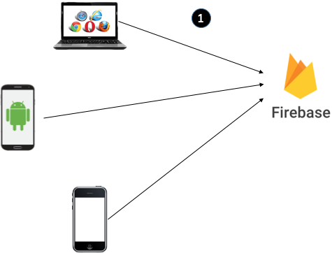
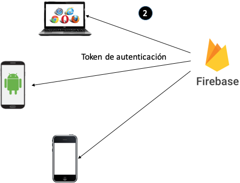
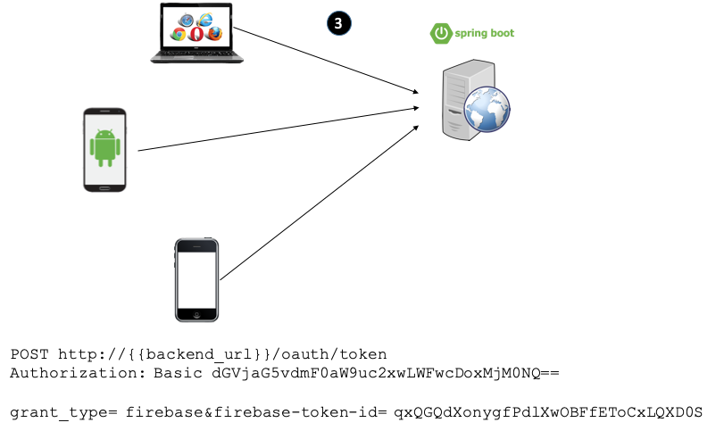
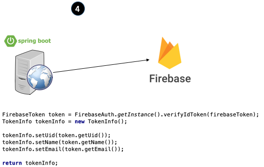

# SPRING BOOT OAUTH2 WITH FIREBASE 

1. As an initial step, client applications use the firebase API to authenticate using Google through Firebase.

2. In response Firebase delivers (among other things) a token-id that will be necessary in the next step:

3. The client application then authenticates with the oAuth2 server of our backend, sending the application credentials in a Basic Authorization header and the Firebase generated token that will serve to authenticate the user:

The backend uses the Firebase API to validate the token and obtain user information in response

As the last step of authentication, the backend generates a JWT that it sends in response to client applications. This token will be sent in all subsequent requests to the backend as a header Authorization of type "Bearer". The backend will no longer need to validate that token against Firebase as it has been generated in the backend

srouce: https://blog.nearsoftjobs.com/spring-boot-oauth2-firebase-d8a4bf37ce15
